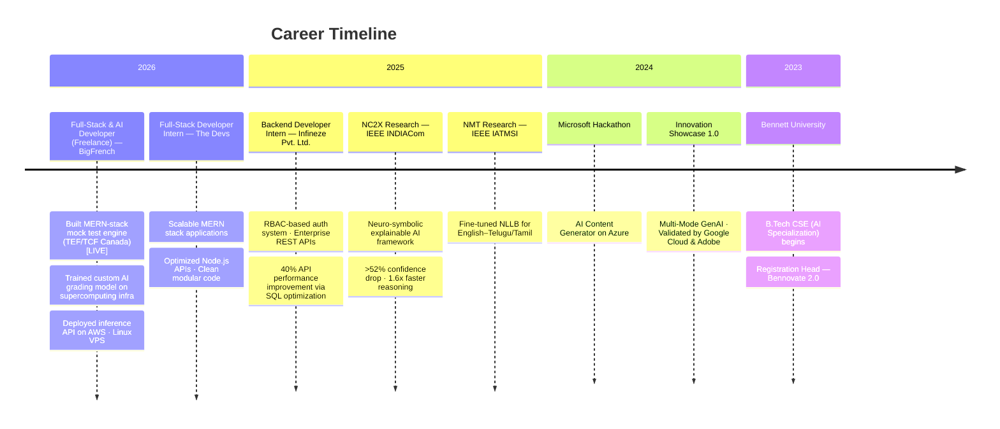

<!-- ══════════════════════════════════════════════════════════════════════════════ -->
<!--                          SURAJ SINGH — GITHUB PROFILE                       -->
<!-- ══════════════════════════════════════════════════════════════════════════════ -->

<div align="center">

  <!-- ─── ANIMATED HERO BANNER ─── -->
  

</div>

<!-- ─── INTRO SECTION ─── -->
<div align="center">

  <h3>AI Researcher  ·  Cloud Architect  ·  Full-Stack Engineer</h3>

  <p>
    <em>"Engineering explainable AI systems (NC2X) and shipping production-grade cloud applications."</em>
  </p>

</div>

<br/>

<!-- ─── DYNAMIC TYPING ─── -->
<div align="center">
  <a href="https://git.io/typing-svg">
    
  </a>
</div>

<br/>

<!-- ─── PROFILE BADGES ─── -->
<div align="center">
  
  &nbsp;
  
  &nbsp;
  
  &nbsp;
  
</div>

<br/>

<!-- ─── SOCIAL LINKS ─── -->
<div align="center">
  <a href="https://suraj-singh-my-portfolio.vercel.app/">
    
  </a>
  &nbsp;
  <a href="https://www.linkedin.com/in/suraj-singh-86a492262/">
    
  </a>
  &nbsp;
  <a href="https://medium.com/@ss2818266">
    
  </a>
  &nbsp;
  <a href="mailto:e23cseu1384@bennett.edu.in">
    
  </a>
  &nbsp;
  <a href="https://leetcode.com/u/oGuiYOeviX/">
    
  </a>
  &nbsp;
  <a href="https://github.com/suraj7880314386">
    
  </a>
</div>

<br/>

<div align="center">
  
</div>

<br/>

<!-- ══════════════════════════════════════════════════════════════════════════════ -->
<!--                                ABOUT ME                                      -->
<!-- ══════════════════════════════════════════════════════════════════════════════ -->


##  &nbsp;About Me

```yaml
name: Suraj Singh
located_in: Greater Noida, India
phone: (+91) 7880314386
email: e23cseu1384@bennett.edu.in

education:
  degree: B.Tech CSE (AI Specialization)
  university: Bennett University
  cgpa: 9.1 / 10.0
  duration: Aug 2023 – May 2027

research_publications: 2  # IEEE INDIACom + IEEE IATMSI
hackathons_participated: 4  # SIH, Hackaccino, Microsoft, Innovation Showcase

current_roles:
  - "Full-Stack & AI Developer (Freelance) — BigFrench TEF/TCF [Live]"
  - "Neuro-Symbolic AI Researcher — NC2X Framework"

expertise:
  ai_ml: ["LangChain", "Multi-Agent RAG", "YOLOv11", "GNNs", "ConvNeXt", "Transformers"]
  full_stack: ["MERN", "Next.js", "FastAPI", "Firebase", "REST APIs"]
  cloud_devops: ["AWS (S3/EC2)", "Azure", "Docker", "CI/CD", "Linux/Unix"]

fun_fact: "I trained a custom AI grading model on supercomputing resources for live exams."
```

<br/>

<!-- ══════════════════════════════════════════════════════════════════════════════ -->
<!--                             EXPERIENCE                                       -->
<!-- ══════════════════════════════════════════════════════════════════════════════ -->


## 💼 &nbsp;Professional Experience



<br/>

<details>
<summary><b>📋 Detailed Experience Breakdown</b></summary>

<br/>

### 🟢 Full-Stack & AI Developer (Freelance) — BigFrench: TEF/TCF `[Live Product]`
> **Feb 2026 – Present** &nbsp;|&nbsp; `Python` `AI/ML` `AWS` `MongoDB` `MERN` `REST APIs`

- Engineered a scalable MERN-stack **mock test engine** with complex state management for real-time exam evaluation
- Developed a **custom AI grading model** to evaluate speaking & writing sections of TEF/TCF Canada exams
- Curated proprietary dataset, trained leveraging **supercomputing resources**, hosted inference API on **AWS**
- Optimized database schemas and deployed on **Linux VPS** ensuring high availability

### 🟢 Full-Stack Developer Intern — The Devs (Remote)
> **Jan 2026 – Mar 2026** &nbsp;|&nbsp; `React.js` `Node.js` `Express.js` `MongoDB` `REST APIs`

- Built and maintained scalable **MERN stack** applications with responsive React UI
- Optimized Node.js APIs and ensured clean, modular code following REST API best practices

### 🟡 Backend Developer Intern — Infineze Pvt. Ltd. (Remote)
> **Sep 2025 – Nov 2025** &nbsp;|&nbsp; `Node.js` `Express.js` `SQL` `RBAC Auth` `REST APIs`

- Designed secure **RBAC-based authentication** system and modular REST APIs for enterprise services
- Improved API performance by **40%** via SQL query optimization, indexing, and structured logging

</details>

<br/>

<!-- ══════════════════════════════════════════════════════════════════════════════ -->
<!--                          RESEARCH PUBLICATIONS                               -->
<!-- ══════════════════════════════════════════════════════════════════════════════ -->


## 🔬 &nbsp;Research Publications

<div align="center">

<!-- Paper 1 -->
<table>
<tr>
<td width="50%">

### 📄 Paper I — NC2X Framework
**IEEE INDIACom** (Under Publication) &nbsp;|&nbsp; Nov 2025

```
┌─────────────────────────────────────────────┐
│                NC2X Pipeline                │
│                                             │
│  ┌──────────┐   ┌──────────┐   ┌────────┐  │
│  │ ConvNeXt │──▶│   GNN    │──▶│ Causal │  │
│  │ +YOLOv11 │   │ Reasoning│   │ Interv.│  │
│  └──────────┘   └──────────┘   └────────┘  │
│       │              │              │       │
│  Perception    Concept Layer   >52% Drop   │
│                                             │
│  🧪 MS-COCO Dataset │ PyTorch              │
│  ⚡ 1.6x Faster Reasoning                  │
│  🏥 Non-invasive disease insight            │
│     (e.g., endometriosis)                   │
└─────────────────────────────────────────────┘
```

`Python` `ConvNeXt` `GNN` `YOLOv11` `MS-COCO` `PyTorch`

</td>
<td width="50%">

### 📄 Paper II — Advancing NMT for Dravidian Languages
**IEEE IATMSI** (Under Review) &nbsp;|&nbsp; Dec 2025

```
┌─────────────────────────────────────────────┐
│        Neural Machine Translation           │
│                                             │
│  ┌──────────┐   ┌──────────┐   ┌────────┐  │
│  │ English  │──▶│   NLLB   │──▶│ Telugu │  │
│  │  Input   │   │Fine-tuned│   │ Tamil  │  │
│  └──────────┘   └──────────┘   └────────┘  │
│                                             │
│  🌐 Low-resource language focus             │
│  🤗 Meta NLLB Transformer                   │
│  📊 Improved BLEU scores for               │
│     English ↔ Telugu/Tamil pairs            │
└─────────────────────────────────────────────┘
```

`Python` `Transformers` `Meta NLLB` `NLP` `HuggingFace`

</td>
</tr>
</table>

<a href="https://medium.com/@ss2818266/nc2x-a-neuro-symbolic-framework-for-concept-causal-and-context-aware-explainability-9e913a2aef33">
  
</a>

</div>

<br/>

<!-- ══════════════════════════════════════════════════════════════════════════════ -->
<!--                              TECH STACK                                      -->
<!-- ══════════════════════════════════════════════════════════════════════════════ -->


## 🧰 &nbsp;Tech Arsenal

<div align="center">

### 🧠 AI / ML / Data Science
<p>
  
  
  
  
  
  
  
  
  
  
</p>

### 🌐 Full-Stack Development
<p>
  
  
  
  
  
  
  
  
  
  
  
  
</p>

### ☁️ Cloud, DevOps & Infrastructure
<p>
  
  
  
  
  
  
  
  
</p>

### 🗄️ Databases & Tools
<p>
  
  
  
  
  
  
</p>

### 🗣️ Languages & Core CS
<p>
  
  
  
  
  
  
</p>

</div>

<br/>

<!-- ══════════════════════════════════════════════════════════════════════════════ -->
<!--                           FEATURED PROJECTS                                  -->
<!-- ══════════════════════════════════════════════════════════════════════════════ -->


## 🚀 &nbsp;Featured Projects

<div align="center">

| # | Project | What I Built | Impact | Stack |
|:-:|---------|-------------|--------|-------|
| 🧠 | **[NC2X Framework](https://medium.com/@ss2818266/nc2x-a-neuro-symbolic-framework-for-concept-causal-and-context-aware-explainability-9e913a2aef33)** `Live Demo` | Neuro-symbolic pipeline: YOLOv11 perception → GNN reasoning → causal intervention | **IEEE Paper** · >52% confidence drop · 1.6x faster reasoning | `Python` `YOLOv11` `GNNs` `PyTorch` |
| 🎙️ | **BigFrench TEF/TCF** `Live` | MERN test engine + custom AI grading model for speaking/writing evaluation | **Production app** · Proprietary dataset · Supercomputing-trained model | `MERN` `AI/ML` `AWS` `MongoDB` |
| 🤖 | **AI Multi-Agent Research Assistant** | Multi-agent RAG pipeline for semantic search & reasoning across documents | Conversational memory · Scalable Docker deployment | `LangChain` `FastAPI` `ChromaDB` `Docker` |
| 🎯 | **HiredNext** | Voice-based AI mock interview platform with real-time role-specific interviews | Vapi.ai + Gemini AI · Category-wise AI scoring dashboard | `Next.js` `Firebase` `Vapi.ai` `Gemini` |
| 🔧 | **AI Agent Tool-Calling API** | Production-ready LLM system with tool-calling (search, calc, DB query) | Structured outputs · Retry logic · Docker-deployed | `LangChain` `FastAPI` `Docker` |
| 🌐 | **Translation System** | End-to-end OCR + NLP for low-resource languages (English ↔ Telugu/Tamil) | **IEEE Paper** · Fine-tuned NLLB transformer | `Transformers` `NLP` `HuggingFace` |
| 🛡️ | **Tourist Safety Platform** | Blockchain-based ID verification with ML anomaly detection | **SIH Hackathon (Team Lead)** · ~92% accuracy | `React` `Web3` `ML` `Node.js` |
| 🐧 | **Mini Linux Shell** | Custom shell: piping, background processes, signal handling | <50ms execution · Zero memory leaks | `C++` `System Programming` |

</div>

<br/>

<!-- ══════════════════════════════════════════════════════════════════════════════ -->
<!--                             GITHUB STATS                                     -->
<!-- ══════════════════════════════════════════════════════════════════════════════ -->


## 📊 &nbsp;GitHub Analytics

<div align="center">

  <a href="https://github.com/suraj7880314386">
    
  </a>
  <a href="https://github.com/suraj7880314386">
    
  </a>

  <br/>

  <a href="https://github.com/suraj7880314386">
    
  </a>

  <br/><br/>

  <!-- GitHub Trophies -->
  <a href="https://github.com/ryo-ma/github-profile-trophy">
    
  </a>

  <br/><br/>

  <!-- Activity Graph -->
  

</div>

<br/>

<!-- ══════════════════════════════════════════════════════════════════════════════ -->
<!--                        ACHIEVEMENTS & CERTIFICATIONS                         -->
<!-- ══════════════════════════════════════════════════════════════════════════════ -->


## 🏆 &nbsp;Achievements & Certifications

<div align="center">

```
 ╔══════════════════════════════════════════════════════════════════════════╗
 ║                         HACKATHONS & COMPETITIONS                       ║
 ╠══════════════════╦═══════════════════════════════════════════════════════╣
 ║  🥇 SIH 2025    ║  Tourist Safety Platform │ Team Lead                 ║
 ║                  ║  Evaluated by Industry Experts                       ║
 ╠══════════════════╬═══════════════════════════════════════════════════════╣
 ║  🎯 Hackaccino  ║  HiredNext (AI Mock Interviewer) │ Participant       ║
 ║     3.0 (2025)  ║  Evaluated by Senior Technical Panel                 ║
 ╠══════════════════╬═══════════════════════════════════════════════════════╣
 ║  ☁️ Microsoft   ║  AI Content Generator │ Participant                  ║
 ║     (Jan 2025)  ║  Evaluated by Microsoft Mentors                      ║
 ╠══════════════════╬═══════════════════════════════════════════════════════╣
 ║  💡 Innovation  ║  Multi-Mode GenAI │ Participant                      ║
 ║     1.0 (2024)  ║  Validated by Google Cloud & Adobe leaders           ║
 ╠══════════════════╩═══════════════════════════════════════════════════════╣
 ║                          CERTIFICATIONS                                 ║
 ╠═════════════════════════════════════════════════════════════════════════╣
 ║  📜 PMP Formulas ─────────────────────────────── Microsoft (Coursera)  ║
 ║  📜 OS & Power User ──────────────────────────── Google (Coursera)     ║
 ║  📜 Object-Oriented C++ ──────────────────────── Codio (Coursera)      ║
 ╠═════════════════════════════════════════════════════════════════════════╣
 ║                     POSITIONS OF RESPONSIBILITY                         ║
 ╠═════════════════════════════════════════════════════════════════════════╣
 ║  🎓 Registration Head ── Bennovate 2.0, Bennett University (Dec 2023) ║
 ║  🧑‍🏫 Mentor ── Freshmen Onboarding (GitHub, Dev Setup) (Aug 2025)     ║
 ╚═════════════════════════════════════════════════════════════════════════╝
```

</div>

<br/>

<!-- ══════════════════════════════════════════════════════════════════════════════ -->
<!--                            IMPACT METRICS                                    -->
<!-- ══════════════════════════════════════════════════════════════════════════════ -->


## 📈 &nbsp;Impact at a Glance

<div align="center">

| Metric | Value | Context |
|:------:|:-----:|---------|
| 📄 | **2** | IEEE Research Papers (INDIACom + IATMSI) |
| ⚡ | **40%** | API Latency Reduction (SQL optimization @ Infineze) |
| 🔬 | **>52%** | Confidence Drop in Causal Intervention Tests (NC2X) |
| 🚀 | **1.6x** | Faster Reasoning via Vectorized Operations |
| 🎯 | **92%** | Anomaly Detection Accuracy (SIH Tourist Safety) |
| 🏥 | **NC2X** | Applied to non-invasive disease insight (endometriosis) |
| 🎓 | **9.1** | CGPA at Bennett University |
| 🏆 | **4** | Hackathons (SIH, Hackaccino, Microsoft, Innovation Showcase) |
| 🌐 | **1** | Live Production App (BigFrench TEF/TCF) |

</div>

<br/>

<!-- ══════════════════════════════════════════════════════════════════════════════ -->
<!--                         CURRENTLY WORKING ON                                  -->
<!-- ══════════════════════════════════════════════════════════════════════════════ -->


## 🔭 &nbsp;What I'm Working On Now

<div align="center">

| Status | Project | Description |
|:------:|---------|-------------|
| 🟢 | **BigFrench TEF/TCF** | Live freelance product — AI-graded language exams on AWS |
| 🟢 | **NC2X v2** | Extending neuro-symbolic framework with ConvNeXt backbone |
| 🟡 | **Multi-Agent Systems** | Building production LLM agents with tool-calling & RAG |
| 🔵 | **Open Source** | Contributing to LangChain, HuggingFace Transformers |
| 🟣 | **Learning** | Diffusion Models, Kubernetes, Rust for systems |

</div>

<br/>

<!-- ══════════════════════════════════════════════════════════════════════════════ -->
<!--                           SNAKE + FOOTER                                     -->
<!-- ══════════════════════════════════════════════════════════════════════════════ -->


## 🐍 &nbsp;Contribution Snake

<div align="center">
  <picture>
    <source media="(prefers-color-scheme: dark)" srcset="https://github.com/suraj7880314386/suraj7880314386/blob/output/github-contribution-grid-snake-dark.svg" />
    <source media="(prefers-color-scheme: light)" srcset="https://github.com/suraj7880314386/suraj7880314386/blob/output/github-contribution-grid-snake.svg" />
    
  </picture>
</div>

<br/>

<!-- ─── FOOTER ─── -->


<div align="center">

  

  <br/><br/>

  <b>💬 Let's Build Something Extraordinary Together</b>

  <br/><br/>

  <a href="https://www.linkedin.com/in/suraj-singh-86a492262/">
    
  </a>&nbsp;
  <a href="mailto:e23cseu1384@bennett.edu.in">
    
  </a>&nbsp;
  <a href="https://suraj-singh-my-portfolio.vercel.app/">
    
  </a>

  <br/><br/>

  <samp><b>⭐ If you find my work interesting, consider giving a star!</b></samp>

</div>
