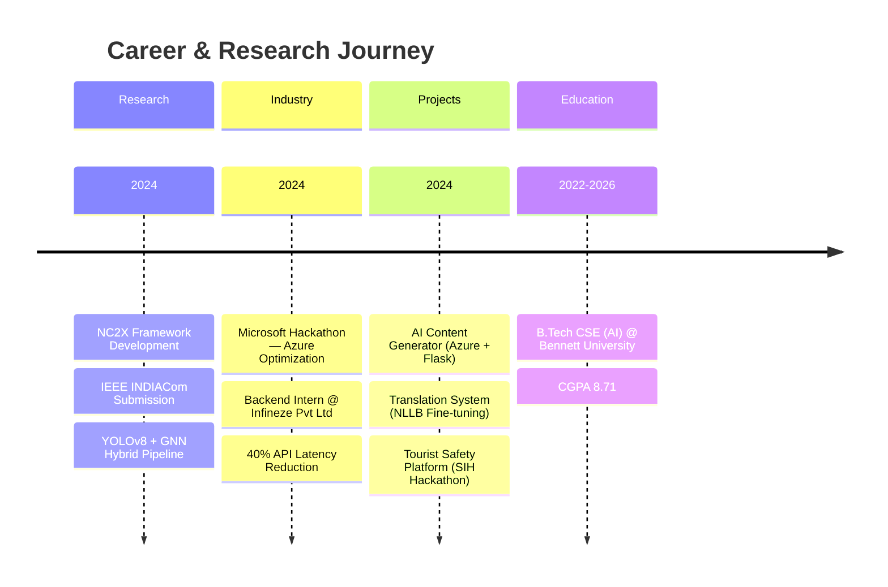

<!-- ══════════════════════════════════════════════════════════════════════════════ -->
<!--                          SURAJ SINGH — GITHUB PROFILE                       -->
<!-- ══════════════════════════════════════════════════════════════════════════════ -->

<div align="center">

  <!-- ─── ANIMATED HERO BANNER ─── -->
  

  <!-- ─── DYNAMIC TYPING ─── -->
  <a href="https://git.io/typing-svg">
    
  </a>

  <br/>

  <!-- ─── PROFILE BADGES ─── -->
  <p>
    
    
    
  </p>

  <!-- ─── SOCIAL LINKS (Animated Hover) ─── -->
  <p>
    <a href="https://suraj-singh-my-portfolio.vercel.app/">
      
    </a>&nbsp;
    <a href="https://www.linkedin.com/in/suraj-singh-86a492262/">
      
    </a>&nbsp;
    <a href="https://medium.com/@ss2818266">
      
    </a>&nbsp;
    <a href="mailto:e23cseu1384@bennett.edu.in">
      
    </a>&nbsp;
    <a href="https://leetcode.com/u/oGuiYOeviX/">
      
    </a>&nbsp;
    <a href="https://github.com/suraj7880314386">
      
    </a>
  </p>

  

</div>

<br/>

<!-- ══════════════════════════════════════════════════════════════════════════════ -->
<!--                                ABOUT ME                                      -->
<!-- ══════════════════════════════════════════════════════════════════════════════ -->


##  &nbsp;About Me — The Short Version

```yaml
name: Suraj Singh
located_in: India
education:
  degree: B.Tech CSE (AI Specialization)
  university: Bennett University
  cgpa: 8.71

current_focus:
  - "NC2X: Neuro-Symbolic Framework for Explainable AI"
  - "Cloud-native architectures on Azure"
  - "Scalable full-stack systems with Redis & Node.js"

research:
  paper: "NC2X — Concept, Causal & Context-Aware Explainability"
  venue: "IEEE INDIACom 2025"
  method: "YOLOv8 + GNNs hybrid pipeline"
  result: ">52% confidence drop in causal intervention tests"

achievements:
  - "🏆 Microsoft Hackathon — 30% latency reduction on Azure"
  - "📉 Reduced API latency 40% via SQL indexing @ Infineze"
  - "🛒 Architected secure E-commerce platforms (Redis + Node.js)"
  - "📄 IEEE Published Researcher"

currently_learning: ["Diffusion Models", "Rust for Systems", "K8s"]
fun_fact: "I debug neural networks and distributed systems for fun."
```

<br/>

<!-- ══════════════════════════════════════════════════════════════════════════════ -->
<!--                             EXPERIENCE TIMELINE                              -->
<!-- ══════════════════════════════════════════════════════════════════════════════ -->


## 🗺️ &nbsp;Experience & Milestones



<br/>

<!-- ══════════════════════════════════════════════════════════════════════════════ -->
<!--                              TECH STACK                                      -->
<!-- ══════════════════════════════════════════════════════════════════════════════ -->


## 🧰 &nbsp;Tech Arsenal

<div align="center">

### 🧠 AI / ML / Data Science
<p>
  
  
  
  
  
  
  
  
  
  
</p>

### ☁️ Cloud & DevOps
<p>
  
  
  
  
  
  
</p>

### 🌐 Full-Stack Development
<p>
  
  
  
  
  
  
  
  
  
  
</p>

### 🗄️ Databases & Tools
<p>
  
  
  
  
  
  
</p>

</div>

<br/>

<!-- ══════════════════════════════════════════════════════════════════════════════ -->
<!--                          FEATURED RESEARCH                                   -->
<!-- ══════════════════════════════════════════════════════════════════════════════ -->


## 🔬 &nbsp;Featured Research — NC2X Framework

<div align="center">

```
╔══════════════════════════════════════════════════════════════════════════╗
║                                                                          ║
║   NC2X: Neuro-Symbolic Framework for Concept, Causal &                   ║
║         Context-Aware Explainability                                     ║
║                                                                          ║
║   📄 Published at IEEE INDIACom 2025                                     ║
║                                                                          ║
║   ┌─────────────┐    ┌──────────────┐    ┌─────────────────┐            ║
║   │  YOLOv8     │───▶│  GNN-based   │───▶│  Causal         │            ║
║   │  Perception │    │  Reasoning   │    │  Intervention   │            ║
║   └─────────────┘    └──────────────┘    └─────────────────┘            ║
║         │                   │                    │                       ║
║         ▼                   ▼                    ▼                       ║
║   ┌─────────────┐    ┌──────────────┐    ┌─────────────────┐            ║
║   │  Object     │    │  Concept     │    │  >52% Conf.     │            ║
║   │  Detection  │    │  Bottleneck  │    │  Drop Achieved  │            ║
║   └─────────────┘    └──────────────┘    └─────────────────┘            ║
║                                                                          ║
║   🚀 1.6x Faster Reasoning via Vectorized Operations                    ║
║                                                                          ║
╚══════════════════════════════════════════════════════════════════════════╝
```

<a href="https://medium.com/@ss2818266/nc2x-a-neuro-symbolic-framework-for-concept-causal-and-context-aware-explainability-9e913a2aef33">
  
</a>

</div>

<br/>

<!-- ══════════════════════════════════════════════════════════════════════════════ -->
<!--                           FEATURED PROJECTS                                  -->
<!-- ══════════════════════════════════════════════════════════════════════════════ -->


## 🚀 &nbsp;Featured Projects

<div align="center">

<!-- Project Card 1 -->
<a href="https://medium.com/@ss2818266/nc2x-a-neuro-symbolic-framework-for-concept-causal-and-context-aware-explainability-9e913a2aef33">

</a>

</div>

<br/>

<details>
<summary><b>📂 Click to expand all projects</b></summary>

<br/>

| # | Project | What I Built | Impact | Stack |
|---|---------|-------------|--------|-------|
| 🏆 | **NC2X Framework** | Neuro-symbolic pipeline combining perception (YOLOv8) with reasoning (GNNs) for explainable AI | **IEEE Paper** · >52% confidence drop · 1.6x faster reasoning | `Python` `PyTorch` `GNNs` `YOLOv8` |
| ☁️ | **AI Content Generator** | Optimized Flask backend with OpenAI API integration, deployed on Azure | **Microsoft Hackathon** · 30% latency reduction | `Azure` `Flask` `OpenAI` `Python` |
| 🌐 | **Translation System** | End-to-end OCR + NLP pipeline for low-resource language translation (Telugu↔Tamil) | Fine-tuned NLLB for underserved language pairs | `Transformers` `NLP` `HuggingFace` |
| 🛡️ | **Tourist Safety Platform** | Blockchain-based ID verification with ML anomaly detection | **SIH Hackathon** · ~92% detection accuracy | `React` `Web3` `ML` `Node.js` |
| 🛒 | **E-Commerce Platform** | Full-stack architecture with session management, caching, and secure payments | Production-grade system with Redis caching | `Node.js` `Redis` `MongoDB` `React` |

</details>

<br/>

<!-- ══════════════════════════════════════════════════════════════════════════════ -->
<!--                             GITHUB STATS                                     -->
<!-- ══════════════════════════════════════════════════════════════════════════════ -->


## 📊 &nbsp;GitHub Analytics

<div align="center">

  <!-- Stats + Streak + Languages -->
  <a href="https://github.com/suraj7880314386">
    
  </a>
  <a href="https://github.com/suraj7880314386">
    
  </a>

  <br/>

  <a href="https://github.com/suraj7880314386">
    
  </a>

  <br/><br/>

  <!-- GitHub Trophies -->
  <a href="https://github.com/ryo-ma/github-profile-trophy">
    
  </a>

  <br/><br/>

  <!-- Activity Graph -->
  

</div>

<br/>

<!-- ══════════════════════════════════════════════════════════════════════════════ -->
<!--                            METRICS & IMPACT                                  -->
<!-- ══════════════════════════════════════════════════════════════════════════════ -->


## 📈 &nbsp;Impact Metrics

<div align="center">

```
 ┌──────────────────────────────────────────────────────────────┐
 │                    KEY ACHIEVEMENTS                          │
 ├──────────────┬───────────────────────────────────────────────┤
 │  📄 IEEE     │  Published NC2X Framework at INDIACom 2025   │
 │  ☁️ Azure    │  30% latency reduction (Microsoft Hackathon) │
 │  📉 Backend  │  40% API latency cut via SQL indexing        │
 │  🎯 ML       │  92% anomaly detection accuracy (SIH)        │
 │  ⚡ Speed    │  1.6x faster reasoning (vectorized ops)      │
 │  🔬 XAI      │  >52% confidence drop in causal tests        │
 │  🎓 GPA      │  8.71 CGPA @ Bennett University              │
 └──────────────┴───────────────────────────────────────────────┘
```

</div>

<br/>

<!-- ══════════════════════════════════════════════════════════════════════════════ -->
<!--                         CURRENTLY WORKING ON                                  -->
<!-- ══════════════════════════════════════════════════════════════════════════════ -->


## 🔭 &nbsp;What I'm Working On

<div align="center">

| Status | Project | Description |
|:------:|---------|-------------|
| 🟢 | **NC2X v2** | Extending the neuro-symbolic framework with attention-based concept bottlenecks |
| 🟡 | **Cloud Microservices** | Building event-driven architectures on Azure with Docker + K8s |
| 🔵 | **Open Source** | Contributing to PyTorch Geometric and Hugging Face Transformers |
| 🟣 | **Learning** | Exploring Diffusion Models, Rust for performance-critical systems |

</div>

<br/>

<!-- ══════════════════════════════════════════════════════════════════════════════ -->
<!--                           SNAKE + FOOTER                                     -->
<!-- ══════════════════════════════════════════════════════════════════════════════ -->


## 🐍 &nbsp;Contribution Snake

<div align="center">
  <picture>
    <source media="(prefers-color-scheme: dark)" srcset="https://github.com/suraj7880314386/suraj7880314386/blob/output/github-contribution-grid-snake-dark.svg" />
    <source media="(prefers-color-scheme: light)" srcset="https://github.com/suraj7880314386/suraj7880314386/blob/output/github-contribution-grid-snake.svg" />
    
  </picture>
</div>

<br/>

<!-- ─── FOOTER ─── -->


<div align="center">

  

  <br/><br/>

  <b>💬 Let's Connect & Build Something Amazing Together!</b>

  <br/><br/>

  <a href="https://www.linkedin.com/in/suraj-singh-86a492262/">
    
  </a>&nbsp;
  <a href="mailto:e23cseu1384@bennett.edu.in">
    
  </a>&nbsp;
  <a href="https://suraj-singh-my-portfolio.vercel.app/">
    
  </a>

  <br/><br/>

  <samp><b>⭐ If you find my work interesting, consider giving a star!</b></samp>

</div>
